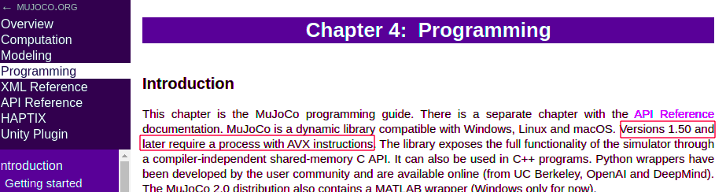
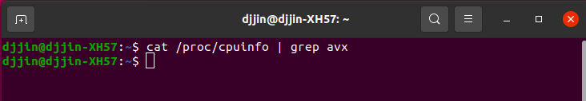
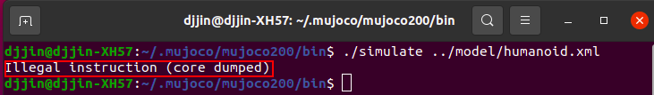
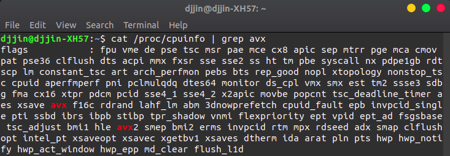
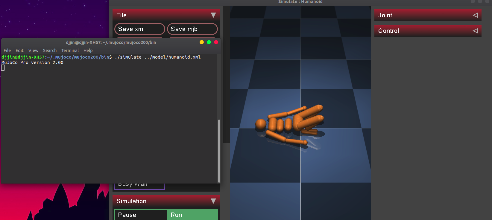
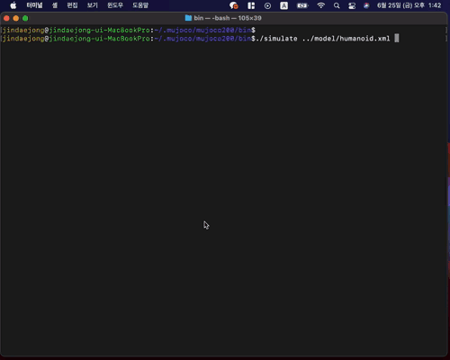

# MuJoCo Package

**macOS와 Ubuntu 18.04 환경에서 MuJoCo 설치 및 튜토리얼 실행 매뉴얼**

[MujoCo](http://www.mujoco.org/index.html) 공식 홈페이지와 [mujoco-py](https://github.com/openai/mujoco-py) github를 참조하여 진행하였습니다.

---

❗MuJoCo 버전 1.5 이상을 사용하려면

Mac 또는 Ubuntu 환경에서 MuJoCo를 시작하기 전에 꼭 **확인**해야 하는 부분이 있습니다❗

<left></left>

AVX(Advanced Vector Extensions) 이란? 👉 [wiki](https://ko.wikipedia.org/wiki/%EA%B3%A0%EA%B8%89_%EB%B2%A1%ED%84%B0_%ED%99%95%EC%9E%A5) 참조

  
고급 벡터 확장
 

> **고급 벡터 확장**(Advanced Vector Extensions,약어:AVX)은 2008년 4월 춘계 [인텔 개발자 포럼](https://ko.wikipedia.org/wiki/인텔_개발자_포럼)에서 발표된 [x86](https://ko.wikipedia.org/wiki/X86) 명령어 집합의 확장으로 [SIMD](https://ko.wikipedia.org/wiki/SIMD)명령어 집합중의 하나이다. SIMD 레지스터의 폭이 128비트에서 256비트로 확장돼서, 최대 2배까지 부동소수점 연산 처리 능력이 향상된다. 또한 기존의 2 피연산자 구조에서 3 피연산자 구조로 변경됨으로 인하여 프로그래밍이 더 효율적이고 성능이 더 뛰어나게 된다. 인텔은 2010년 1월에 발표한 [샌디 브리지](https://ko.wikipedia.org/wiki/샌디_브리지) 마이크로아키텍처기반 프로세서부터 지원을 시작했으며 AMD는 불도저(Bulldozer) 프로세서에서 선보일 예정이다. AVX에 관련된 백서가 인텔 소프트웨어 네트워크에 있으며[[1\]](https://ko.wikipedia.org/wiki/고급_벡터_확장#cite_note-1) 또한 온라인상에 참조 매뉴얼이 있다.[[2\]](https://ko.wikipedia.org/wiki/고급_벡터_확장#cite_note-2)

**내 CPU에 AVX 기능이 있는지 확인하기**

- Mac

  ~~~shell
  $ sysctl -a | grep avx
  ~~~

- Ubuntu

  ~~~shell
  $ cat /proc/cpuinfo | grep avx
  ~~~

  

    
AVX 정보가 안 나올 경우?
 
  
  
  
  <left></left>
  
  아무것도 나오지 않는다면 cpu를 교체하거나 MuJoCo 버전을 낮춰야 합니다 😂
  
  <left></left>
  
  저는 avx 기능이 있는 cpu로 교체 후 해결하였습니다.
  
  <left></left>
  
  아래의 화면이 나오면 설치 성공입니다.
  
  <left></left>
  
  

## 1. Install MuJoCo

- **라이센스 키 발급**

  👉 [MuJoCo website](https://www.roboti.us/license.html)에 접속하여 30일 또는 1년 라이센스 키를 받습니다.

- **MuJoCo ver2.0 바이너리 파일 다운로드**

  👉 [Download website](https://www.roboti.us/index.html)에 접속하여 mujoco 파일 다운로드 및 압축 해제 후 디렉토리 명을 mujoco200으로 변경해줍니다.

- **~/.mujoco 디렉토리에 복사**

  👉 mjkey.txt(라이센스 키)와 mujoco200 디렉토리를 ~/.mujoco 디렉토리 안으로 복사합니다.

  ~~~shell
  $ mkdir ~/.mujoco
  $ cp -r mjkey.txt mujoco200 ~/.mujoco/
  $ cp -r mjkey.txt ~/.mujoco/mujoco200/bin/
  ~~~

- **mujoco 시뮬레이터 실행하기**

  ~~~shell
  $ cd ~/.mujoco/mujoco200/bin
  $ ./simulate ../model/humanoid.xml
  ~~~

  <left></left>å

## 2. Install and use mujoco-py

저의 경우 local 환경에 설치하는 걸 꺼려해서 anaconda 설치 후 진행하였습니다.

👉 [anaconda 다운로드](https://www.anaconda.com/products/individual#download-section)

👉 [anaconda 사용방법](https://github.com/jdj2261/ubuntu-first-install/blob/master/ubuntu-18.04/anaconda-manual.md)

### 2-1. 의존 패키지 설치하기

#### ✍ in Mac (python 3.9)

- llvm, boost, hdf5 패키지 설치

  ~~~shell
  $ brew install llvm
  $ brew install boost
  $ brew install hdf5
  ~~~

- .bashrc 또는 .zshrc 에 llvm 설치 경로 추가

  

    
예시
 

  ~~~shell
  $ vi ~/.bashrc
  # 맨 아래로 가서 i를 눌러 끼워넣기 모드로 변경
  # 아래의 내용 복사 하기
  ------------------------------------------
  export PATH="/usr/local/opt/llvm/bin:$PATH"
  
  export CC="/usr/local/opt/llvm/bin/clang"
  export CXX="/usr/local/opt/llvm/bin/clang++"
  export CXX11="/usr/local/opt/llvm/bin/clang++"
  export CXX14="/usr/local/opt/llvm/bin/clang++"
  export CXX17="/usr/local/opt/llvm/bin/clang++"
  export CXX1X="/usr/local/opt/llvm/bin/clang++"
  
  export LDFLAGS="-L/usr/local/opt/llvm/lib"
  export CPPFLAGS="-I/usr/local/opt/llvm/include" 
  ------------------------------------------
  # 복사 후 esc 또는 ctrl+[ 누른 후 :wq 입력 후 엔터
  ~~~

  

#### ✍ in Ubuntu 18.04 (python 3.7)

- libosmesa6-dev libgl1-mesa-glx libglfw3 설치

  ~~~shell
  $ sudo apt install -y libosmesa6-dev libgl1-mesa-glx libglfw3
  ~~~

- bashrc에 LD_LIBRARY_PATH, LD_PRELOAD 추가

  ~~~shell
  $ vi ~/.bashrc
  export LD_LIBRARY_PATH=${LD_LIBRARY_PATH}:$HOME/.mujoco/mujoco200/bin
  export LD_PRELOAD=/usr/lib/x86_64-linux-gnu/libGLEW.so
  ~~~

### 2-2. mujoco-py 설치

👉 설치하는 방법은 두 가지가 있으며 저는 2번째 방법으로 설치하였습니다.

- pip로 설치하기

  ~~~shell
  $ pip install -U 'mujoco-py<2.1,>=2.0'
  ~~~

- python setup.py 로 설치하기

  ~~~shell
  $ git clone https://github.com/openai/mujoco-py.git
  $ cd mujoco-py
  $ python setup.py install
  ~~~

### 2-3. 예제 실행하기

- test.py 만든 후 실행

  

    
test.py
 

  ~~~python
  import mujoco_py
  import os
  mj_path, _ = mujoco_py.utils.discover_mujoco()
  xml_path = os.path.join(mj_path, 'model', 'humanoid.xml')
  model = mujoco_py.load_model_from_path(xml_path)
  sim = mujoco_py.MjSim(model)
  
  print(sim.data.qpos)
  sim.step()
  print(sim.data.qpos)
  ~~~

  

  👌 제대로 설치가 되었다면 에러가 나지 않고 데이터가 나와야합니다.

- examples 디렉토리에 있는 예제 실행

  1.  실행 후 이 에러가 난다면? 👉  [참고](https://talkingaboutme.tistory.com/entry/RL-mujocopy-ERROR-GLEW-initalization-error-Missing-GL-version)

     > ERROR: GLEW initalization error: Missing GL version

     해당 라이브러리를 preload 시켜줍니다.

     > export LD_PRELOAD=/usr/lib/x86_64-linux-gnu/libGLEW.so 

  2.  실행 후 이 에러가 난다면?

     > Exception: Failed to load XML file: xmls/fetch/main.xml. mj_loadXML error: b'XML parse error at line 0, column 0:\nFailed to open file\n'

     xml 파일을 불러올 때 경로를 찾지 못한 문제로 파일을 수정해줍니다.

     > from
     >
     > load_model_from_path("xmls/tosser.xml")
     >
     > to
     >
     > load_model_from_path("../xmls/tosser.xml")

#### Docker로 실행할 경우

**라이센스 키가 개인 상업용 라이선스 이어야 합니다.**

  
도커로 실행
 

- [도커 설치하기](https://github.com/jdj2261/ubuntu-first-install/blob/master/ubuntu-18.04/Docker-manual.md)

- mjkey.txt(라이센스 키) mujoco-py 디렉토리 안으로 복사 후 Dockerfile 실행 (약 10분 소요)

  ~~~shell
  $ cd ~/.mujoco && cp -r mjkey.txt mujoco-py/
  $ docker build mujoco-py
  ~~~

- 도커 이미지 확인

  ~~~shell
  $ docker images
  ~~~

- 도커 이미지로 컨테이너 생성

  ~~~shell
  $ docker create -i -t --name mujoco docker_id /bin/bash
  ~~~

- 컨테이너 실행

  ~~~shell
  $ docker start mujoco
  $ docker attach mujoco
  ~~~

- 컨테이너 삭제 및 이미지 삭제

  ~~~shell
  # 컨테이너 삭제
  $ docker rm -f mujoco 
  # 이미지 삭제
  $ docker rmi 이미지id
  ~~~

## Reference

- [mujoco.org](http://www.mujoco.org/index.html)
- [mujoco-py](https://github.com/openai/mujoco-py)
- [windows 10에서 mujoco_py 구동하기](https://talkingaboutme.tistory.com/entry/RL-Windows-10-mujoco-py?category=538748)

- [gym.openai.com](https://gym.openai.com/envs/#mujoco)

