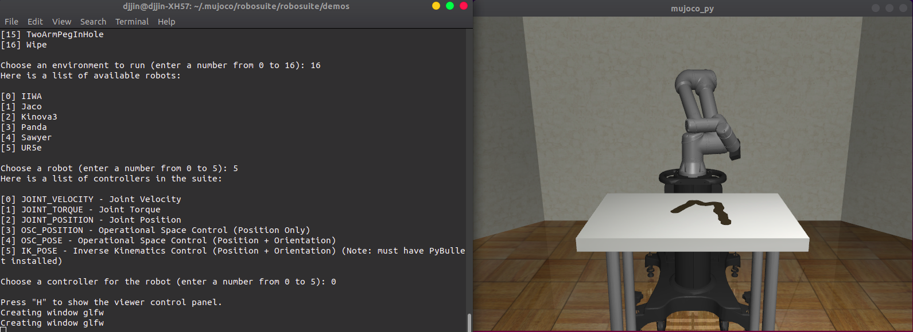

# Robosuite installation

**Ubuntu 18.04 환경에서 Robosuit 설치 및 튜토리얼 실행 매뉴얼**

robosuite [ 공식 홈페이지](https://robosuite.ai/docs/overview.html)와 [github](https://github.com/openai/mujoco-py)를 참조하여 진행하였습니다.

mujoco-py 설치와 마찬가지로 conda 환경 설치하였고, 2가지 방법이 있으며 저는 2번째 방법으로 설치하였습니다.

## 1. pip로 설치

~~~shell
$ source anaconda/bin/activate
$ conda activate mujoco-py3.7
~~~

- install robosuite

  ~~~shell
  $ pip install robosuite
  ~~~

- Test your installation with

  ~~~shell
  $ python -m robosuite.demos.demo_random_action
  ~~~

## 2. 소스파일 다운로드 후 설치

- Clone the robosuite repository

  ~~~shell
  $ cd ~/.mujoco
  $ git clone https://github.com/StanfordVL/robosuite.git
  $ cd robosuite
  ~~~

- Install the base requirements with

  ~~~shell
  $ pip install -r requirements.txt
  $ pip3 install -r requirements-extra.txt
  ~~~

## 3. Test

- Test your installation with

  ~~~shell
  $ cd .mujoco/robosuite/robosuite/demos
  $ python demo_random_action.py
  $ python demo_control.py
  $ python demo_device_control.py
  ~~~

  demo result

  <left></left>

---

next 👉  <a href="robosuite-quickstart.md"> quickstart</a> 

---

