# Introduction to Robotics

[Introduction to Robotics book PDF](http://www.mech.sharif.ir/c/document_library/get_file?uuid=5a4bb247-1430-4e46-942c-d692dead831f&groupId=14040), Third Edition.  *John J*. *Craig*,

 : 고려대학교 송재복 교수님

## Chapter 1. Spatial descriptions and Transformations

### 1-1. Descriptions: Pose, Position, Orientation

---

|                                                         |                                                          |
| :-----------------------------------------------------: | :------------------------------------------------------: |
| 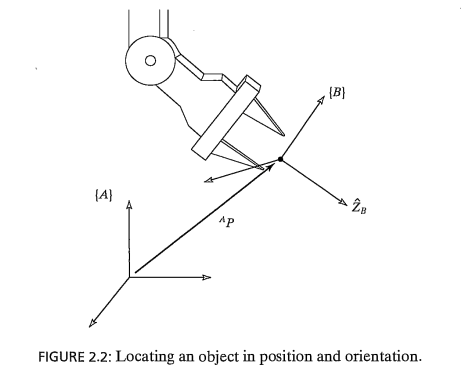 | 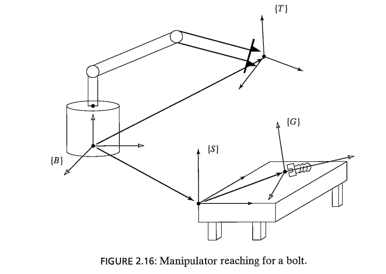 |

---

#### - Pose = position(위치) + orientation(방위, 자세, ...)

- example : [ROS Pose Message](http://docs.ros.org/en/noetic/api/geometry_msgs/html/msg/Pose.html)

#### - Position

- **Description of a position**

  -  : position vector of P written in {A}

  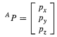

#### - Orientation

- **Description of a orientation**

  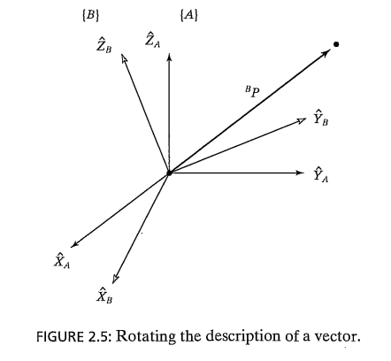

  ---

  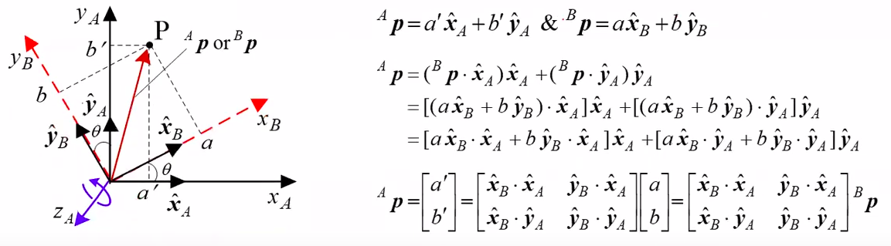

  ---

  -  : the vector whose components are the projections of that vector onto the unit directions of its reference frame.

  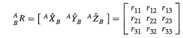

  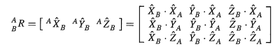

- **Physical meaning of rotation matrix**

  -  : rotation matrix from the coordinates of P relative to {B} to coordinates relative to {A}

  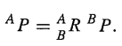

  

  > Example 

  ---

  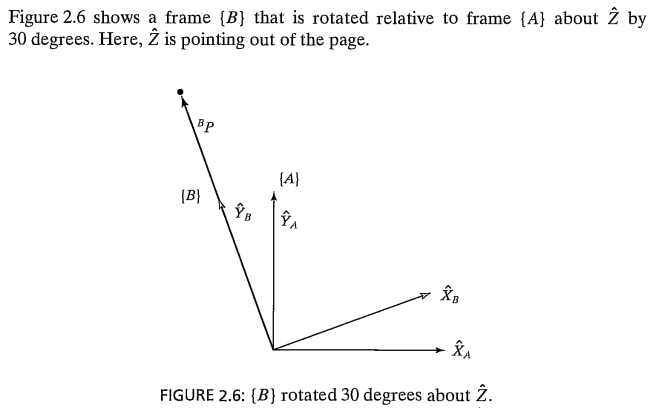

  ---

  Given, 

  we obtain

  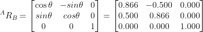

  we calculate  as

  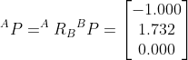

  ---

- **Properties of a rotation matrix**

  **orthonormal matrix(직교 행렬)**

  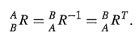

  

  

  

  Indeed, from linear algebra, we know that the inverse of a matrix with orthonormal columns is equal to its transpose.

  

  - Orthogonality conditions 

    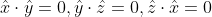

  - Unit length conditions

    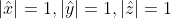

  Only 3 components are independent among 9 components of a rotation matrix because 6 conditions are imposed.]

  즉, 3개의 파라미터만 결정을 하면 orientation이 정해진다는 의미입니다.

### 1-2.  Operators: Translation, Rotation, and Transformation

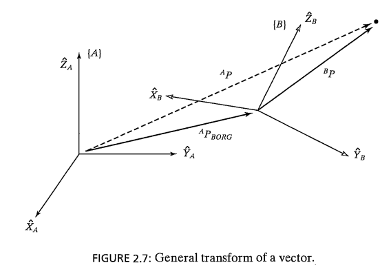

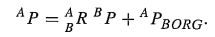

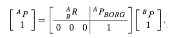

- Homogeneous transform (동차변환) 

  4 x 4 matrix

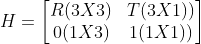

- Pure translation

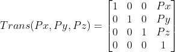

- Pure Rotation (Elementary rotation)

  - General rotation : a suitable sequence of three elementary rotations on condition that two successive rotations are not made about parallel axes.

  - Fixed angle representation (12 sets)

    Rotation with respect to the fixed axes 👉 Absolute transforms

    Typically, XYZ fixed angles (roll, pitch, yaw angles)

  - [Euler angle](https://en.wikipedia.org/wiki/Euler_angles) representation (12 sets)

    Rotation with respect to the current axes (or body-fixed axes) 👉 Relative transforms

    XYZ, ZXY, XZX, XYX, YXZ, YZX, YXY, YZY, ZXY, ZYZ, ZXZ, ZYX

    Typically, ZYX Euler angles and ZYZ Euler angles

  - 각도 계산 시 [arctan2](https://numpy.org/doc/stable/reference/generated/numpy.arctan2.html)를 이용

    arctan : range [-pi/2, pi/2]

    arctan2 : range [-pi, pi], arctan2(y, x) = arctan2(sin(theta), cos(theta))

    ~~~python
    result_arctan = np.arctan([-1/-1]) * 180 / np.pi
    >>> [45.]
    result_arctan2 = np.arctan2([-1], [-1]) * 180 / np.pi
    >>> [-135.]
    ~~~

    

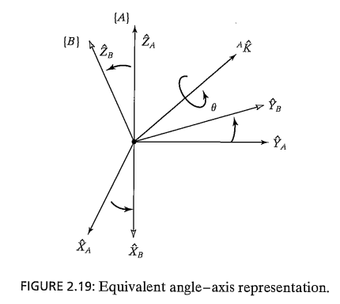

| 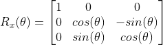 | 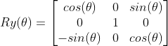 | 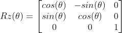 |
| --------------------------------------------- | ---------------------------------------------- | --------------------------------------------- |

- Homogeneous transform

  H = Translation x Rotation, 

  H = TR

  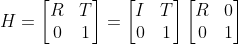
  
  : Inverse  transform matrix

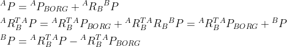

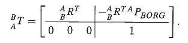

### 1-3.  Relative transform and Absolute transform

- Relative transform
  - Translation relative to the current frame ==> Rotation relative to the current frame
  - Each transform is performed relative to the current frame.
  - The final frame is computed by **post-multiplying** (left -> right) the corresponding transformation matrices successively.
- Absolute transform
  - Rotation relative to the fixed frame -> Translation relative to the fixed frame
  - Each transform is performed relative to the fixed(reference) frame.
  - The final frame is computed by **pre-multiplying** (right -> left) the corresponding transformation matrices successively.

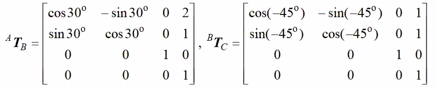

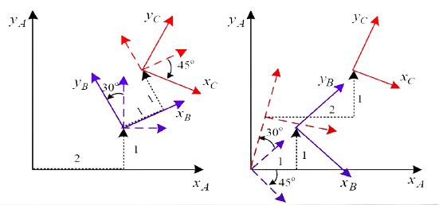

>H = T1 * R1 * T2 * R2
>
>Relative transform
>
>- (Translation of A -> B) ---> (Rotation of A -> B) ---> (Translation of B -> C) ---> (Rotation of B->C)
>
>Absolute transform
>
>- (Translation of A -> B) <--- (Rotation of A -> B) <--- (Translation of B -> C) <--- (Rotation of B->C)

### 1-4. Transform Equations

> Examples

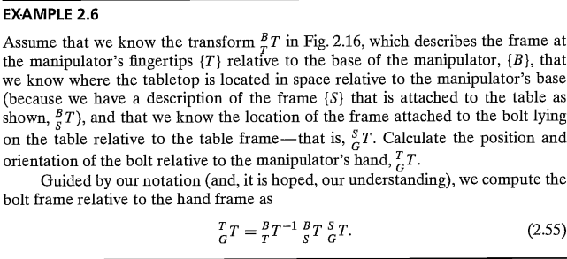

### 1-5. More on representation of Orientation

#### - Inverse XYZ Fixed angles, ZYX Euler angles, ZYZ Euler angles problem

- **XYZ fixed angles**

  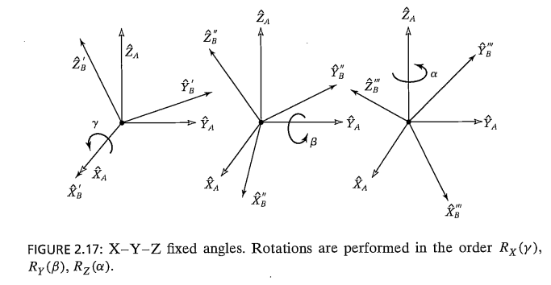

  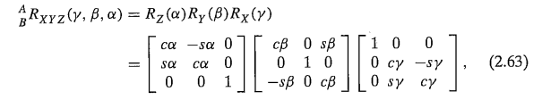

  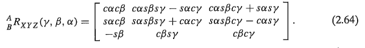

  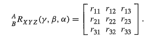

  - if 

    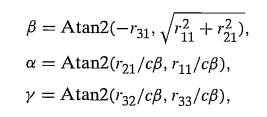

    **we always compute the single solution for which **

  - If 

    

    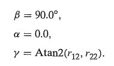

    

  - If 

    

    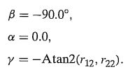

    

    In those cases, only the sum or the difference of  and  can be computed.

    -> **Infinitely many solution for  and **

    Not able to distinguish the rotation  and  

    ->**Representation singularity** (1 자유도 상실)

- **ZYX Euler angles**

  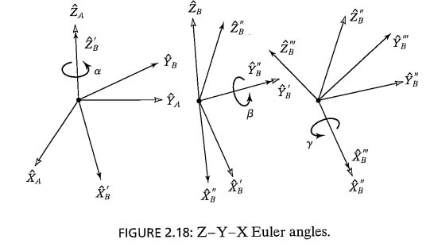

  **three rotations taken about fixed axes yield the same final orientation as the same three rotations taken in opposite order about the axes of the moving frame.**

- **ZYZ Euler angles**

  **we always compute the single solution for which **

  If or ,

  In those cases, only the sum or the difference of  and  can be computed.

  Not able to distinguish the rotation  and  

  ->**Representation singularity** (1 자유도 상실)

### 1-6. Equivalent angle-axis representation

[wikipedia](https://en.wikipedia.org/wiki/Axis%E2%80%93angle_representation)

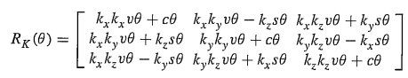

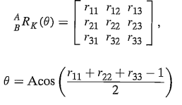

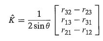

**Singularity : The solution given by fails if  = 0° or  = 180**

### 1-7. Unit Quaternion

[wikipedia](https://en.wikipedia.org/wiki/Quaternion)

- **Euler parameters.**

  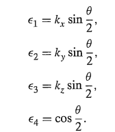

  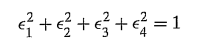, Only three parameters are independent.

  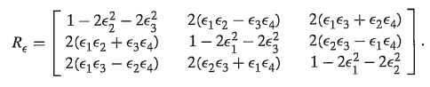

  

  **not Singularity**

---

next 👉  <a href="robotics-02_forward_kinematics.md"> forward kinematics</a> 

---

