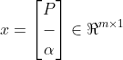
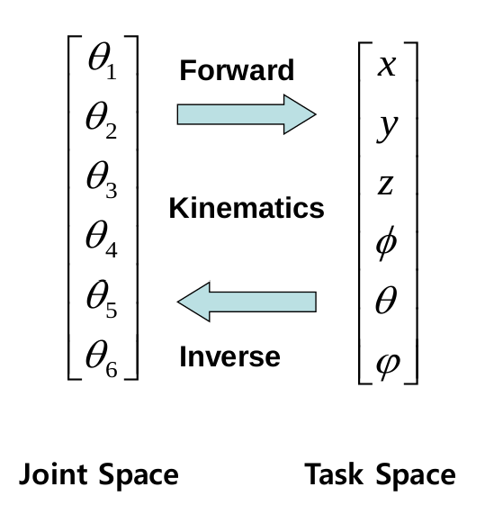
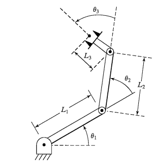
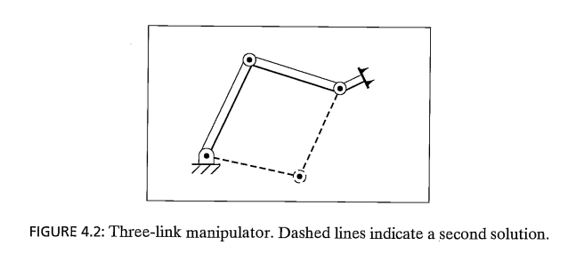
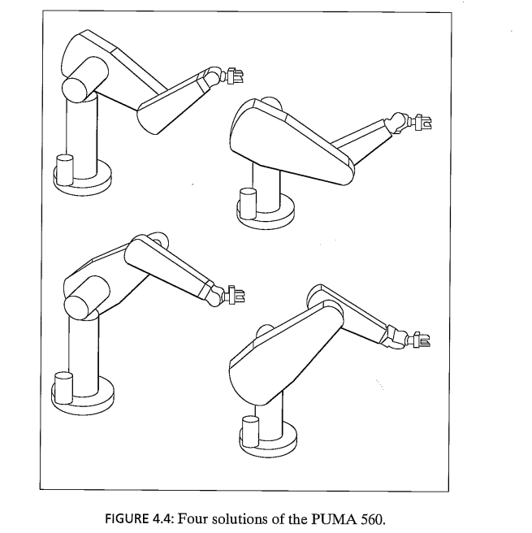

# Introduction to Robotics

[Introduction to Robotics book PDF](http://www.mech.sharif.ir/c/document_library/get_file?uuid=5a4bb247-1430-4e46-942c-d692dead831f&groupId=14040), Third Edition.  *John J*. *Craig*,

 : 고려대학교 송재복 교수님

## Chapter 2. Manipulator kinematics

### 2-1. Introduction

- **Kinematics**

  - The relationship between position, velocity, acceleration and time of the arm links.

  - The forces which cause motion are not included in kinematics.

- **Roles of kinematics in the robot arm**

  - The relationship between the end-effector pose(position, orientation) and the joint variables can be obtained by studying kinematics.

- **Joint space(관절 공간)**

  - Joint vector : a vector consisting of n joint variables of arm

    

  - Joint space : a space consisting of all joint vectors

- **Cartesian space (직교 공간) (or operational, task space)**

  - End- effector pose vector

    , where p : end-effector position &  : end-effector orientation

  - A space in which the end-effector pose is measured in the Cartesian coordinate system.

### 2-2. Forward kinematics

- **Joint space -> Cartesian space**

  

### 2-3. Inverse kinematics

- **Cartesian space -> Joint space**

|                                            |                                            |
| ------------------------------------------ | ------------------------------------------ |
|  |  |

---

next 👉  <a href="robotics-03_jacobian.md">jacobian matrix</a> 

---
