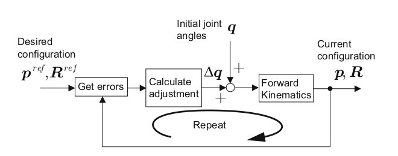

# Introduction to Humanoid Robotics

Shuuji Kajita · Hirohisa Hirukawa · Kensuke Harada · Kazuhito Yokoi

[TOC]

## Numerical Solution to Inverse Kinematics

by **Newton-Raphson method** 

출처  : [Wikipedia](https://en.wikipedia.org/wiki/Newton%27s_method)

**Algorithm**

- Step 1. Prepare the position and attitude () of the base link

- Step 2. Prepare the position and attitude () of the target link

- Step 3. Define vector **q** which holds the joint angles from the base link to the target link

- Step 4. Use forward kinematics to calculate the position and attitude() of the target link

- Step 5. Calculate the difference in position and attitude () = ()

- Step 6. If () are small enough, stop the calculation
- **Step 7**. If () are not small enough, calculate  which would reduce the error
- **Step 8**. Update joint angles by  and return to **Step 4**

**Two Questions**

1. What do we really mean by the position and attitude errors () being small enough? (**Step 7**)

   - 

     

2. How do we actually go about calculating , to narrow the gap? (**Step 8**)
